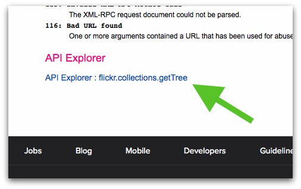
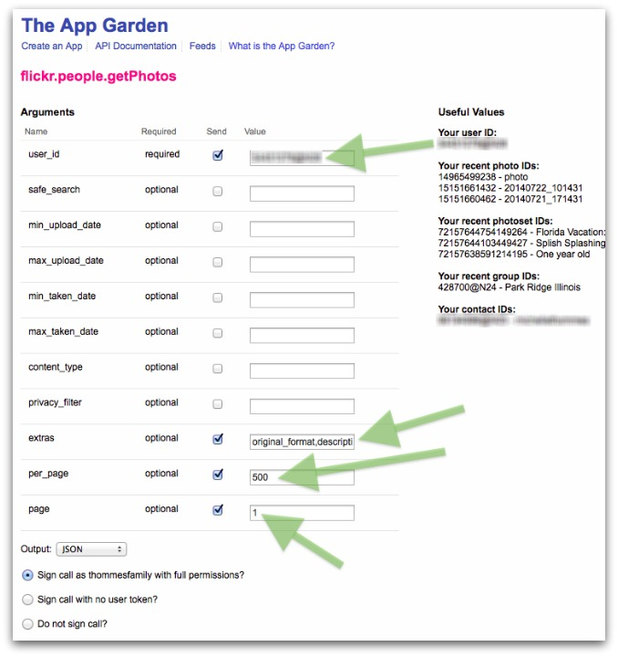
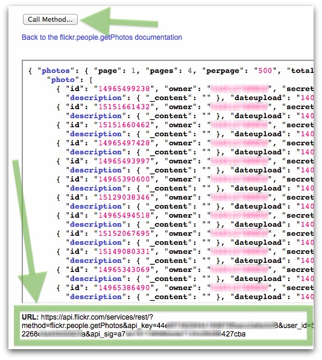

Flickr API scripts
==========

Working with the Flickr API.

## `fetch_photos.php`

This script will fetch your Flickr photos (including collections and sets) and save them locally, or on Amazon S3.

### Installation

To get started, create a file called `api_urls.php` and put it in the same directory as the `fetch_photos.php` file. The contents of `api_urls.php` should be:

		<?php

				$collections_getTree_url = "";
				$photosets_getList_url = "";
				$photosets_getPhotos_url = "";
				$photosets_getPhotos_url .= "&extras=original_format%2Cdescription%2Cdate_upload%2Cdate_taken%2Cgeo%2Cphotosets&per_page=" . $photos_perpage . "&page=1";

				$people_getPhotos_url = "";

		?>

I'm using a lazy interface to the Flickr API. Instead of doing authentication stuff and loading external API libraries, I've decided to keep it simple for now. The [Flickr App Garden](https://www.flickr.com/services/api/) has an API Explorer for each method, and we can temporarily use the full API URL's provided there to fetch the data. See below for how to get each API URL for the variables in `api_urls.php`:

* `$collections_getTree_url`: [API Explorer link](https://www.flickr.com/services/api/explore/flickr.collections.getTree)
* `$photosets_getList_url`: [API Explorer link](https://www.flickr.com/services/api/explore/flickr.photosets.getList)
* `$photosets_getPhotos_url`: [API Explorer link](https://www.flickr.com/services/api/explore/flickr.photosets.getPhotos)
* `$people_getPhotos_url`: [API Explorer link](https://www.flickr.com/services/api/explore/flickr.people.getPhotos)

To get to the API Explorer (for each method), click the link at the bottom:

For the `people_getPhotos_url`, fill in the arguments as illustrated below:

Copy your `user_id` from the right-hand side. The `extras` value should be:

`original_format,description,date_upload,date_taken,geo`

When you click "Call Method..." it will load the data into the textbox and generate the API URL:

We'll use this URL to read the Flickr data. Populate the value in `api_urls.php` with the **full URL**.

**NOTE: The `api_key`, `auth_token`, and `api_sig` might expire quickly, so you'll have to regenerate the URL's (if you plan to use the script frequently).**

### Sending photos to Amazon S3

Create a file called `aws_config.php` and put it in the same directory as `api_urls.php`. `aws_config.php` should contain:

	<?php

		$s3 = new Aws("AWS_KEY", "AWS_SECRET", "s3");
		$s3_bucket = "BUCKET_NAME";
		$s3_dir = "photos/flickr/" . $datestamp . "/";

	?>